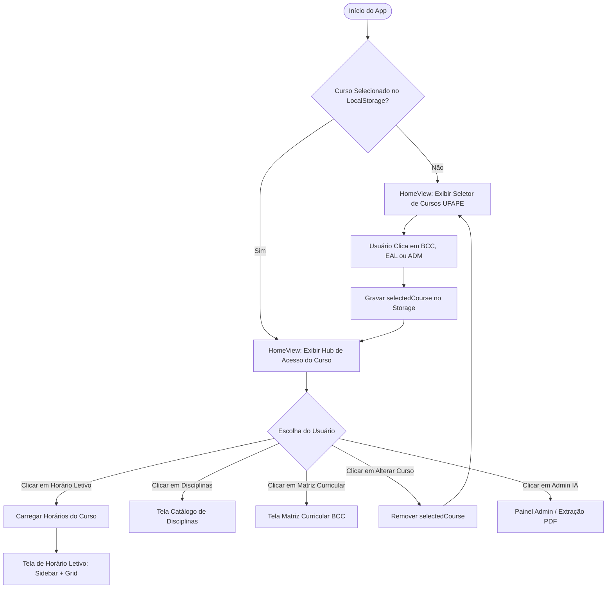
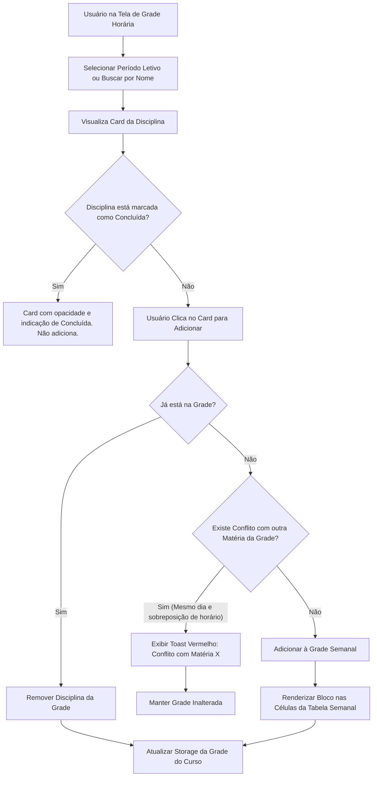
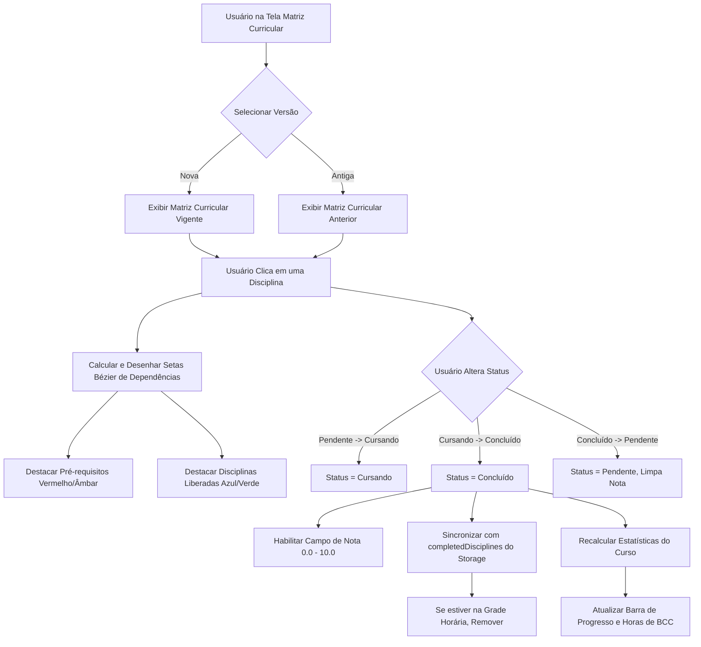
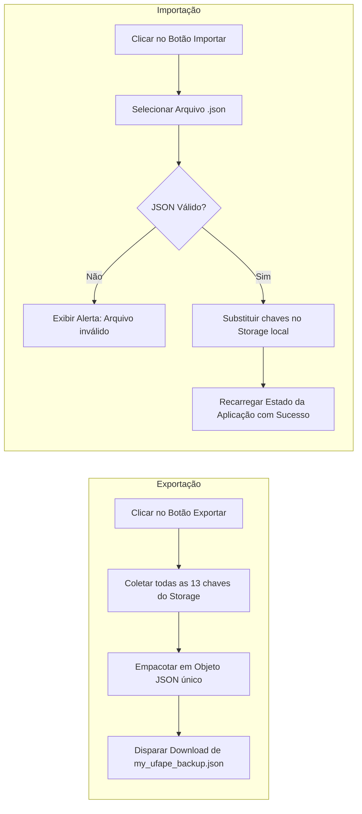
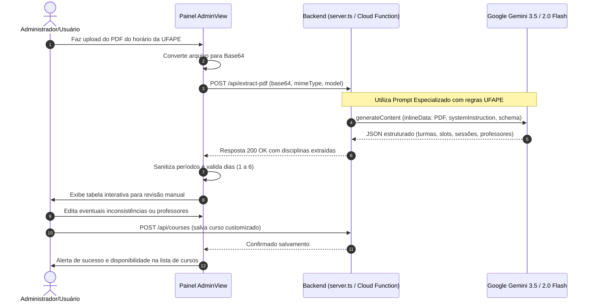

# 05 - Fluxos de Usuário e Navegação

Este documento mapeia os principais fluxos operacionais do usuário dentro do **My UFAPE**, utilizando diagramas visuais em formato **Mermaid**.

---

## 1. Fluxo Geral de Navegação do Aplicativo

---

## 2. Fluxo de Montagem de Grade e Resolução de Conflitos

---

## 3. Fluxo de Acompanhamento da Matriz Curricular (BCC)

---

## 4. Fluxo de Backup e Restauração de Dados

---

## 5. Fluxo de Extração de Grade em PDF via Inteligência Artificial

