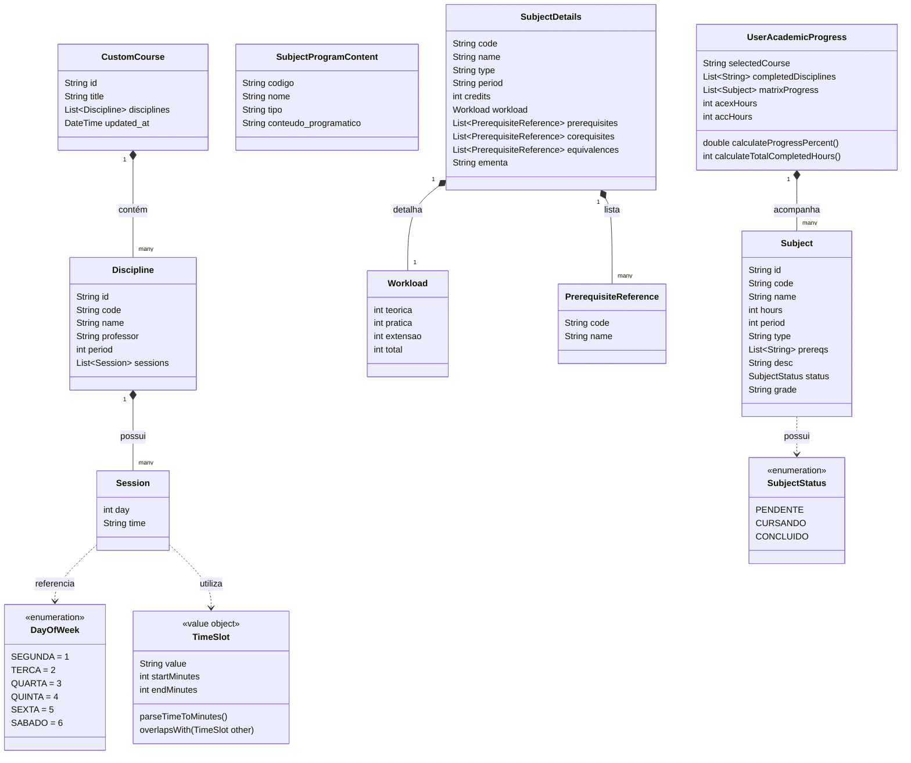

# 06 - Modelo de Domínio e Classes

Este documento formaliza as entidades, objetos de valor (Value Objects), tipos enumerados e diagramas de relacionamento do domínio do **My UFAPE**.

---

## 1. Diagrama de Classes do Domínio

---

## 2. Descrição das Entidades e Objetos de Valor

### 2.1. `Discipline` (Disciplina da Grade Horária)
Representa a oferta de uma disciplina em um semestre específico, contendo turma, professor e suas sessões semanais.
- `id` (`String`): Identificador único da matéria no semestre (ex: `"p1_1"`, `"p1_intro_prog_t1"`).
- `code` (`String?`): Código acadêmico formal da disciplina (ex: `"CCMP3057"`, `"MATM3008"`).
- `name` (`String`): Nome oficial da disciplina com identificação de turma se aplicável (ex: `"Introdução à Programação I (Turma 1)"`).
- `professor` (`String`): Nome do docente responsável (ou `"-"` se não informado).
- `period` (`int`): Período letivo recomendado da turma (1 a 9). Se for optativa ou eletiva, o valor é `0`.
- `sessions` (`List<Session>`): Lista de aulas semanais da disciplina.

### 2.2. `Session` (Sessão de Aula)
Representa um bloco de aula da disciplina.
- `day` (`int`): Inteiro representando o dia da semana:
  - `1`: Segunda-feira
  - `2`: Terça-feira
  - `3`: Quarta-feira
  - `4`: Quinta-feira
  - `5`: Sexta-feira
  - `6`: Sábado
- `time` (`String`): Faixa de horário formatada estritamente segundo os blocos oficiais do sistema (ex: `"14:00 - 16:00"`, `"18:30 - 20:10"`).

### 2.3. `Subject` (Disciplina da Matriz Curricular)
Representa o nó de disciplina na árvore curricular de Ciência da Computação.
- `id` (`String`): Slug único identificador da matéria (ex: `"intro_prog_1"`, `"calc_1"`, `"paa"`).
- `code` (`String?`): Código acadêmico formal (ex: `"CCMP3057"`).
- `name` (`String`): Nome da disciplina na matriz.
- `hours` (`int`): Carga horária total em horas (ex: `60`, `90`, `300`).
- `period` (`int`): Período letivo correspondente na grade curricular (1 a 9).
- `type` (`String`): Núcleo de formação da disciplina:
  - `"basico"`: Núcleo Básico (Matemática, Física).
  - `"computacao"`: Núcleo Tecnológico e Teórico de Computação.
  - `"optativa"`: Eletivas e optativas de livre escolha.
  - `"estagio"`: Estágio Supervisionado Obrigatório.
  - `"outros"`: Metodologia Científica, Empreendedorismo, Sociedade.
- `prereqs` (`List<String>`): Array com os IDs das disciplinas que são pré-requisitos diretos para cursar esta matéria.
- `desc` (`String`): Descrição sintética da ementa.
- `status` (`SubjectStatus`): Estado atual do aluno nesta disciplina (`pendente`, `cursando`, `concluido`).
- `grade` (`String`): Nota final registrada pelo aluno (0.0 a 10.0), preenchida quando concluída.

### 2.4. `SubjectDetails` (Ficha Detalhada do Catálogo)
Dados pedagógicos oficiais do PPC do curso:
- `code` (`String`): Código identificador no catálogo.
- `name` (`String`): Nome da disciplina em caixa alta.
- `type` (`String`): Natureza ("Obrigatório", "Optativo").
- `period` (`String`): Período de oferta.
- `credits` (`int`): Total de créditos acadêmicos.
- `workload` (`Workload`):
  - `teorica` (`int`): Carga teórica em sala/laboratório.
  - `pratica` (`int`): Carga prática.
  - `extensao` (`int`): Carga creditada em atividades extensionistas.
  - `total` (`int`): Soma total das cargas horárias.
- `prerequisites` (`List<PrerequisiteReference>`): Lista com código e nome dos pré-requisitos.
- `corequisites` (`List<PrerequisiteReference>`): Lista com código e nome de co-requisitos simultâneos.
- `equivalences` (`List<PrerequisiteReference>`): Códigos de disciplinas antigas ou equivalentes reconhecidas.
- `ementa` (`String`): Texto integral da ementa pedagógica da disciplina.

### 2.5. `CustomCourse` (Curso Customizado Extraído)
Objeto utilizado pelo módulo de administração e extração de PDF:
- `id` (`String`): Identificador único slug (ex: `"bcc_2026_1"`).
- `title` (`String`): Nome amigável do curso/turma extraído.
- `disciplines` (`List<Discipline>`): Lista de disciplinas processadas.
- `updated_at` (`String` / `DateTime`): Carimbo de data/hora ISO 8601 da última atualização.
