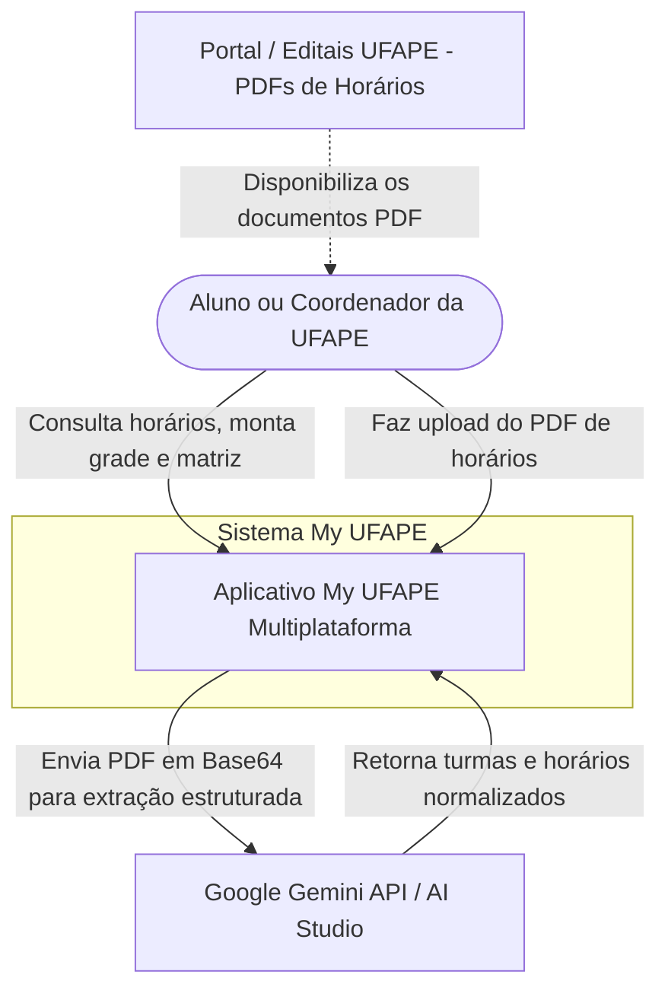
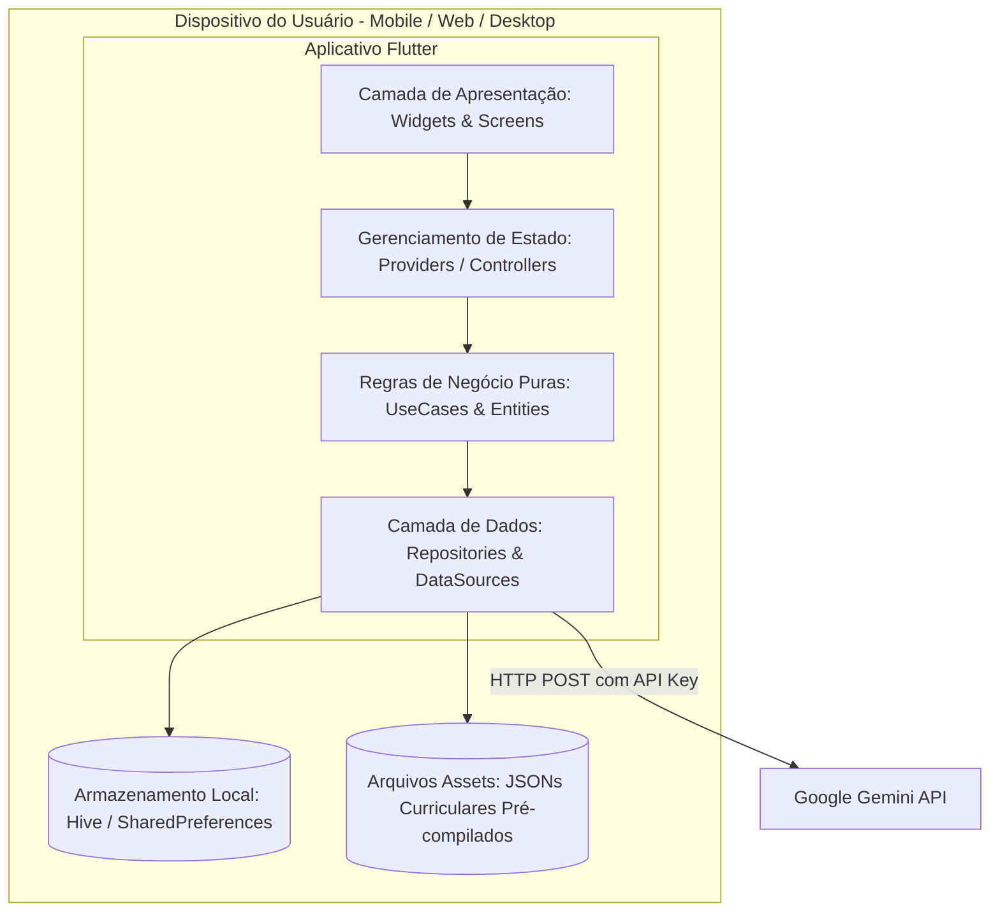

# 11 - Arquitetura e Decisões Técnicas

Este documento compara a arquitetura legada (React SPA + Express) com a **nova arquitetura proposta para Flutter (Dart)**, documentando as decisões estruturais e os diagramas de contexto e contêiner (C4).

---

## 1. Visão Geral da Arquitetura Legada vs. Nova

```
[Arquitetura Legada (React Web)]
Browser (Chrome/Safari)
└── React 18 SPA (Vite)
    ├── useSchedule.ts (Hook monolítico com todo o estado e lógica)
    ├── Telas & Componentes Tailwind CSS
    └── localStorage (Persistência no navegador)
        └── [Opcional] Express.js (server.ts) para Gemini API & JSONs

──────────────────────────────────────────────────────────

[Nova Arquitetura Alvo (Flutter Multiplataforma)]
Mobile (Android/iOS) | Web | Desktop (Windows/macOS/Linux)
└── Flutter Engine (Skia / Impeller)
    ├── Presentation Layer (Screens, Widgets, Responsive Layout, CustomPainter)
    ├── Application / State Layer (Riverpod / ChangeNotifier Providers)
    ├── Domain Layer (Entities, Value Objects, Use Cases de Negócio)
    └── Data Layer (Repositories, Local Storage Hive/SharedPreferences, Gemini Service)
```

---

## 2. Diagramas C4

### 2.1. C4 - Nível 1: Diagrama de Contexto



### 2.2. C4 - Nível 2: Diagrama de Contêineres (Arquitetura Flutter)



---

## 3. Estrutura de Camadas Recomendada para o Projeto Flutter

A organização do código em Flutter deve seguir o padrão de **Clean Architecture** / Camadas Claras, garantindo testabilidade, manutenção e independência de framework:

```
lib/
├── core/
│   ├── constants/              # Constantes de dias, slots, limites (3200h, 320h, 90h)
│   ├── theme/                  # Definições de temas Claro e Escuro (Material 3)
│   └── utils/                  # Utilitários de data, formatadores e normalizadores de texto
├── data/
│   ├── datasources/
│   │   ├── asset_data_source.dart      # Leitura dos arquivos JSON locais em assets/data/
│   │   ├── local_storage_source.dart   # Leitura/Escrita no SharedPreferences ou Hive
│   │   └── gemini_remote_source.dart   # Integração direta com o SDK google_generative_ai
│   ├── models/                         # Classes com fromJson / toJson
│   │   ├── discipline_model.dart
│   │   ├── subject_model.dart
│   │   └── custom_course_model.dart
│   └── repositories/                   # Implementações dos repositórios
│       ├── schedule_repository_impl.dart
│       └── curriculum_repository_impl.dart
├── domain/
│   ├── entities/                       # Entidades puras do negócio (sem dependência do Flutter)
│   │   ├── discipline.dart
│   │   ├── session.dart
│   │   └── subject.dart
│   ├── repositories/                   # Contratos de repositórios (interfaces abstratas)
│   └── usecases/                       # Casos de uso específicos e isolados
│       ├── check_schedule_conflict.dart
│       ├── calculate_matrix_progress.dart
│       ├── check_prerequisites_unlocked.dart
│       └── export_backup_usecase.dart
├── presentation/
│   ├── controllers/                    # Notifiers / Blocs / Controllers de Estado
│   │   ├── schedule_controller.dart
│   │   ├── matrix_controller.dart
│   │   └── theme_controller.dart
│   ├── screens/                        # Telas completas
│   │   ├── home_screen.dart
│   │   ├── schedule_screen.dart
│   │   ├── matrix_screen.dart
│   │   ├── catalog_screen.dart
│   │   └── admin_screen.dart
│   └── widgets/                        # Widgets modulares reutilizáveis
│       ├── schedule_grid_widget.dart
│       ├── matrix_graph_painter.dart   # CustomPainter para desenhar as curvas Bézier
│       ├── discipline_card.dart
│       └── discipline_details_sheet.dart
└── main.dart                           # Ponto de entrada do app Flutter
```

---

## 4. Decisões Técnicas Justificadas

### 4.1. Gerenciamento de Estado: `ChangeNotifier` ou `Riverpod`
- **Decisão:** Recomenda-se `ChangeNotifier` nativo com `Provider` para menor curva de aprendizado ou `flutter_riverpod` para projetos com injeção de dependência e imutabilidade robusta.
- **Motivo:** O estado global da aplicação é relativamente simples (disciplinas da grade, matérias concluídas, tema ativo e curso selecionado). Um controlador centralizado `ScheduleNotifier` substitui com precisão o hook React `useSchedule.ts`.

### 4.2. Persistência Local: `shared_preferences` + `hive`
- **Decisão:** Utilizar `shared_preferences` para strings de configuração simples e `hive` ou leitura/escrita de arquivos JSON locais no diretório de dados do app (`path_provider`).
- **Motivo:** Operação 100% offline, ultrarrápida e sem necessidade de setup de servidor de banco de dados SQL.

### 4.3. Renderização do Grafo de Conectores: `CustomPainter`
- **Decisão:** Substituir a camada SVG HTML por um widget `CustomPaint` associado a um `CustomPainter` (`MatrixGraphPainter`).
- **Motivo:** O `CustomPainter` do Flutter utiliza diretamente a engine gráfica C++ (Skia/Impeller) para desenhar caminhos vetoriais com antialiasing, garantindo 60 a 120 FPS cravados mesmo durante o pan/zoom com `InteractiveViewer`.

### 4.4. Integração com Gemini: Pacote Oficial `google_generative_ai`
- **Decisão:** No aplicativo Flutter, a extração de PDF pode ser feita chamando diretamente a biblioteca oficial `package:google_generative_ai` do ecossistema Dart/Flutter, ou mantendo o backend Express caso a chave de API não deva ficar exposta no cliente.
- **Opção Recomendada:**
  - *Modo Standalone / Desktop / Local:* O usuário insere sua chave de API nas configurações do app e o app se comunica diretamente com a API do Gemini.
  - *Modo Web Público:* O app se comunica com uma Cloud Function / servidor backend seguro que guarda a `GEMINI_API_KEY`.
