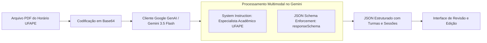

# 13 - Integração com Inteligência Artificial e Extração de PDF

Este documento especifica a engenharia de prompt, esquemas de dados e fluxos de integração com a API do **Google Gemini** para extração automatizada de grades horárias e turmas da UFAPE em formato PDF.

---

## 1. Arquitetura da Integração com IA



---

## 2. Prompt de Sistema Oficial (`systemInstruction`)

O prompt abaixo foi especificamente projetado e testado para os quadros de horário emitidos pela UFAPE (geralmente gerados por sistemas acadêmicos internos ou planilhas exportadas para PDF):

```text
Você é um cientista de dados acadêmicos especialista em extração e mapeamento de grades horárias e grades curriculares universitárias da UFAPE (Universidade Federal do Agreste de Pernambuco).
Analise detalhadamente o documento PDF fornecido contendo os quadros de horário letivo.

--- REGRAS DE EXTRAÇÃO CRÍTICAS (PADRÃO DO SISTEMA) ---
1. IDENTIFICAÇÃO DE TURMA E PERÍODO:
   - Cada tabela começa com um cabeçalho identificando a turma, por exemplo: 'TURMA: 1º período (Turma 1) CC5' ou 'TURMA: 2º período (Turma 2) CC2'.
   - Extraia o período recomendado como um número inteiro. Ex: '1º período' -> 1, '2º período' -> 2, '6º período' -> 6. Se for eletiva/optativa ou desconhecido, use 0.
   - Inclua a informação da turma no nome da disciplina caso a tabela indique. Ex: 'Introdução à Programação I (Turma 1)' ou 'Introdução à Programação I (Turma 2)'.

2. MAPEAMENTO DE DIAS DA SEMANA (INTEIROS SEGUNDO O SISTEMA):
   - seg ou Segunda -> 1
   - ter ou Terça -> 2
   - qua ou Quarta -> 3
   - qui ou Quinta -> 4
   - sex ou Sexta -> 5
   - sab, Sábado ou Sábado -> 6

3. ADAPTAÇÃO E DIVISÃO DE HORÁRIOS PARA OS TIMESLOTS PADRÃO DO SISTEMA:
   O sistema suporta estritamente os seguintes horários de aulas (TimeSlots):
   - '14:00 - 16:00'
   - '16:00 - 18:00'
   - '18:30 - 20:10'
   - '20:10 - 21:50'
   Qualquer horário extraído deve se adaptar para uma dessas fatias. Se houver um bloco de 4 horas como 'h1400_1800' ou '14:00 - 18:00', divida-o obrigatoriamente em DUAS sessões para aquela mesma disciplina no mesmo dia: uma na faixa '14:00 - 16:00' e outra na faixa '16:00 - 18:00'!
   Mapeie 'h1830_2010' para '18:30 - 20:10' e 'h2010_2150' para '20:10 - 21:50'.

4. AGREGAÇÃO DAS SESSÕES POR DISCIPLINA (MUITO IMPORTANTE):
   - NÃO crie múltiplos itens de disciplina repetidos para a mesma matéria e mesma turma!
   - Uma disciplina deve ser um único objeto no array de resultado, aglutinando todas as suas aulas encontradas na tabela dentro do seu array 'sessions'.
   - Por exemplo, se 'Lógica Matemática I (Marcius)' ocorre na Quarta às 18:30 - 20:10 e na Sexta às 18:30 - 20:10, crie apenas uma disciplina no array contendo as duas sessões dentro do parâmetro 'sessions'.

5. NOMES DOS PROFESSORES:
   - Identifique e extraia o professor fornecido entre parênteses no final do conteúdo da célula. Ex: 'Cálculo I (Normando)' -> Nome da disciplina: 'Cálculo I', Professor: 'Normando'.
   - Caso o professor não esteja disponível, preencha com '-'.

6. CÓDIGOS ACADÊMICOS INTERNOS (CODE):
   - Gere um código acadêmico realista se ele não tiver na célula, seguindo o padrão de 4 letras e 4 números (ex: CCMP3057 para Introdução à Programação, MATM3008 para matemática, ou baseado nas iniciais da disciplina como ALGE3021 para Álgebra Linear, etc.).
   - O ID deve ser um slug amigável em minúsculo do nome e turma, por exemplo: 'p1_introducao_programacao_t1'.
```

---

## 3. Schema Estruturado da Resposta da IA (`responseSchema`)

Para garantir que o Gemini retorne exatamente o JSON desejado sem texto explicativo ou marcação de markdown adicional, o SDK utiliza `responseMimeType: "application/json"` e a seguinte definição de schema:

```json
{
  "type": "OBJECT",
  "properties": {
    "title": {
      "type": "STRING",
      "description": "Título do curso ou nome sugerido para a grade baseada no arquivo, por exemplo: 'BCC 2026.1 - Horário Letivo'"
    },
    "disciplines": {
      "type": "ARRAY",
      "description": "Lista estruturada de todas as disciplinas encontradas unificadas sem duplicações",
      "items": {
        "type": "OBJECT",
        "properties": {
          "id": { "type": "STRING", "description": "ID único em minúsculo, por exemplo: p1_intro_prog_t1" },
          "code": { "type": "STRING", "description": "Código acadêmico de 4 letras e 4 números, ex: CCMP1234" },
          "name": { "type": "STRING", "description": "Nome limpo da disciplina com respectiva turma, ex: Introdução à Programação I (Turma 1)" },
          "professor": { "type": "STRING", "description": "Nome do professor da disciplina" },
          "period": { "type": "INTEGER", "description": "Período correto de 1 a 9. Use 0 se for optativa/eletiva." },
          "sessions": {
            "type": "ARRAY",
            "items": {
              "type": "OBJECT",
              "properties": {
                "day": { "type": "INTEGER", "description": "1=Seg, 2=Ter, 3=Qua, 4=Qui, 5=Sex, 6=Sáb" },
                "time": { "type": "STRING", "description": "'14:00 - 16:00', '16:00 - 18:00', '18:30 - 20:10', '20:10 - 21:50'" }
              },
              "required": ["day", "time"]
            }
          }
        },
        "required": ["id", "code", "name", "professor", "period", "sessions"]
      }
    }
  },
  "required": ["title", "disciplines"]
}
```

---

## 4. Implementação Nativa em Dart/Flutter (`package:google_generative_ai`)

No Flutter, essa extração pode ser executada sem intermediários utilizando o pacote oficial do Google:

```dart
import 'dart:convert';
import 'dart:typed_data';
import 'package:google_generative_ai/google_generative_ai.dart';

class GeminiPdfExtractorService {
  final String apiKey;

  GeminiPdfExtractorService({required this.apiKey});

  Future<Map<String, dynamic>> extractFromPdfBytes(Uint8List pdfBytes) async {
    final model = GenerativeModel(
      model: 'gemini-1.5-flash', // ou 'gemini-2.0-flash'
      apiKey: apiKey,
      generationConfig: GenerationConfig(
        responseMimeType: 'application/json',
      ),
      systemInstruction: Content.system(systemInstructionText),
    );

    final pdfPart = DataPart('application/pdf', pdfBytes);
    final prompt = TextPart(
      'Extraia cuidadosamente todas as turmas, horários e disciplinas descritos neste documento curricular seguindo os critérios estruturais sistêmicos descritos.'
    );

    final response = await model.generateContent([
      Content.multi([prompt, pdfPart])
    ]);

    if (response.text == null || response.text!.isEmpty) {
      throw Exception('Não foi possível extrair dados do documento PDF.');
    }

    return jsonDecode(response.text!) as Map<String, dynamic>;
  }
}
```
Com isso, o app Flutter ganha a capacidade de extrair horários de qualquer PDF de forma autônoma, local e com processamento em nuvem ultra veloz.
